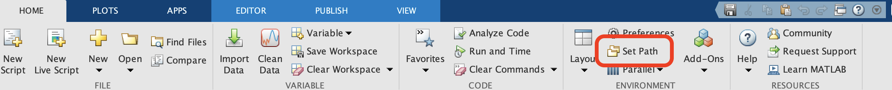

# Installing BInSAR

## Fast Installation Instructions

1. Clone this library into a dedicated `Libraries` directory separate from your intended MATLAB project directory.
2. Add this library to your MATLAB path.

## Detailed Installation Instructions

1. Open MATLAB and navigate to your preferred MATLAB work directory using the top bar (circled in red). Right click in the Current Folder tab to make new directories as circled in green.

    

1. Make your favorite version of the following directory structure in your MATLAB work directory.

    

1. Clone this repository into the `Libraries` directory. [Github Desktop](https://github.com/apps/desktop) is recommended for users unfamiliar with command line. The download URL is:
    
    * `https://github.com/zhurewitz/insar-bayesian-sbas.git`

    Your directory structure should now look like:

    

1. At the top of the screen in the `Home` tab, click the `Set Path` button as shown. Add the library to your path and save. [See MATLAB documentation for more details.](https://www.mathworks.com/help/matlab/matlab_env/add-remove-or-reorder-folders-on-the-search-path.html)

    

    The directories and files which have been added to the path are now highlighted, while those not on the path remain faded.

    