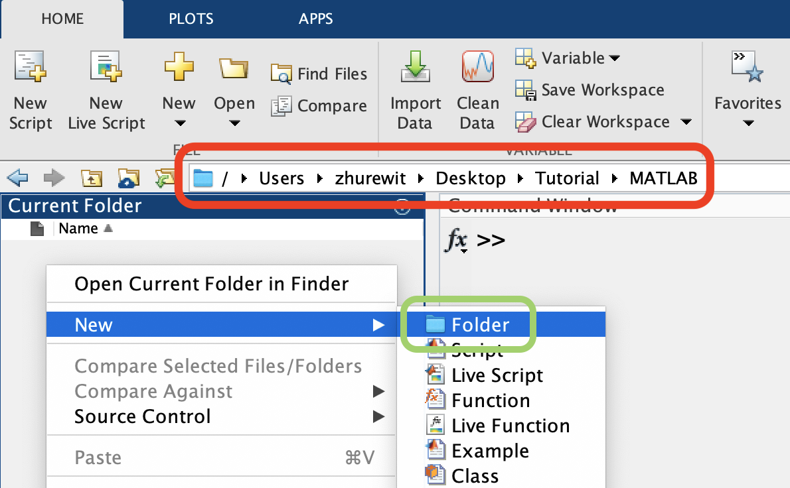
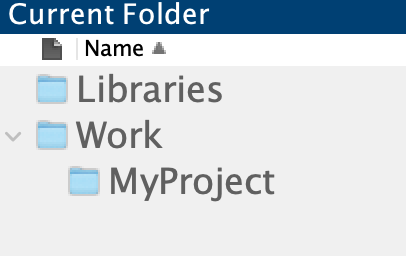
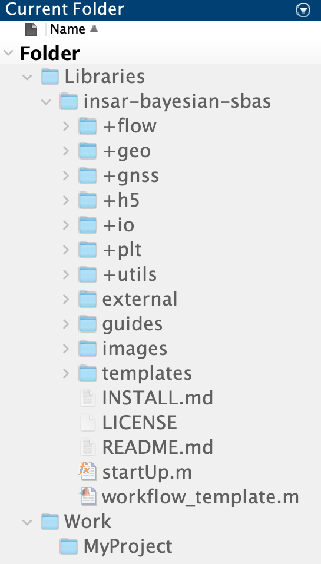
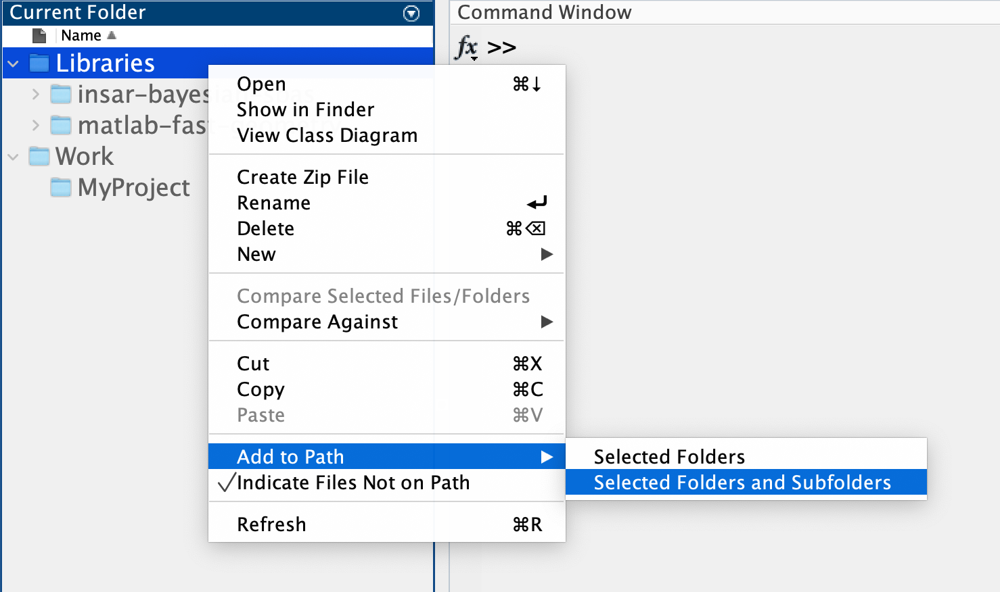
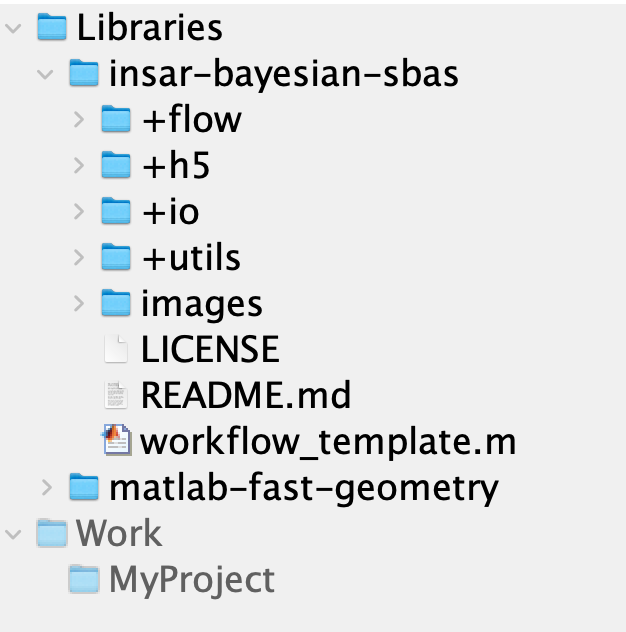

# BInSAR - Bayesian SBAS Timeseries Estimation for InSAR


## Getting Started


### Fast Installation Instructions

1. Clone this library and the [`matlab-fast-geometry`](https://github.com/zhurewitz/matlab-fast-geometry) library into a dedicated `Libraries` directory separate from your intended work directory.
2. Add all folders and subfolders of `Libraries` to your MATLAB path.


### Detailed Installation Instructions

1. Open MATLAB and navigate to your preferred MATLAB work directory using the top bar (circled in red). Right click in the Current Folder tab to make new directories as circled in green.

    

1. Make your favorite version of the following directory structure in your MATLAB work directory.

    

1. Clone this repository and the [`matlab-fast-geometry`](https://github.com/zhurewitz/matlab-fast-geometry) library into the `Libraries` directory.  

    1. Open the Terminal application (in Utilities, inside the Applications folder).
    
    2. Navigate to the `Libraries` directory using the `cd` command. Use the top bar (red circle) in the image in step 1 to make the path. For the above example the command would be:

        ```
        cd /Users/zhurewit/Desktop/Tutorial/MATLAB/Libraries
        ```

    2. Run the following commands:

        ```
        git clone https://github.com/zhurewitz/insar-bayesian-sbas.git
        git clone https://github.com/zhurewitz/matlab-fast-geometry.git
        ```

    3. Your directory structure should now look like:

        

1. Right click on the `Libraries` folder and add selected folders and subfolders to the working path as shown below.

    

    The directories and files which have been added to the path are now highlighted, while those not on the path remain faded.

    